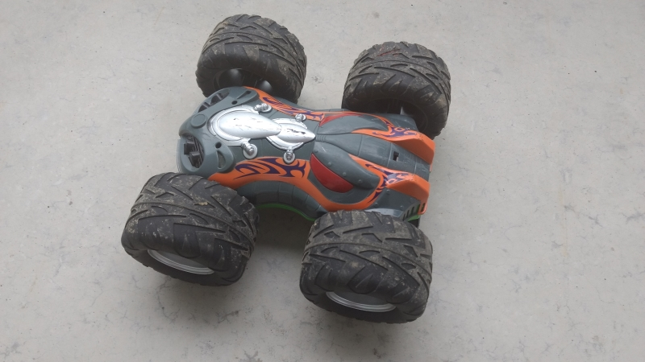
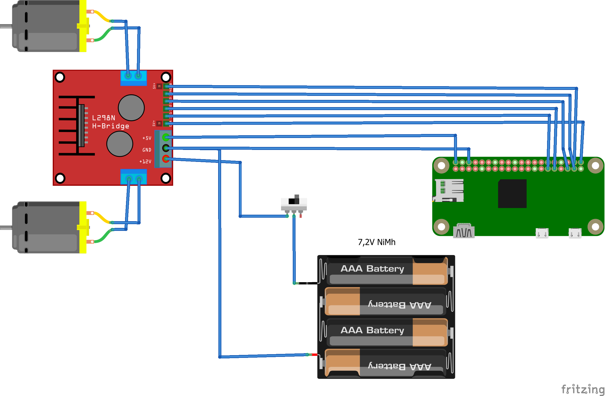
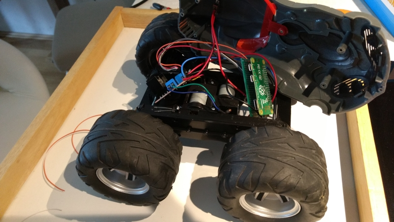

# Raspberry powered RC car

A Raspberry Pi Zero W, LM298N dual motor driver, Dickie Toys Wild Flippy controlled by 
Android phone or tablet  



## Hardware 

I am reusing all the existing hardware from the Wild Flippy, except the electronic board.
So i will have to connect raspberry to the motor driver and the dc motors to the driver.



**Make sure to set up the jumper on the LM298N so it will provide 5V output to supply the pi.**
(This jumper is not included in the image above.)





## Raspberry 
Flash the latest Raspbian Stretch Lite image onto a sd card  
(see: https://www.raspberrypi.org/downloads/raspbian/)

Once the SD card is complete, add two files to it.  

For WiFi Setup, add the wpa supplicant file to root folder of the SD card:  

_wpa_supplicant.conf_
```
network={
    ssid="SSID"
    psk="password"
    key_mgmt=WPA-PSK
}
```

To enable SSH you need to add another file to the root folder  
_ssh_
```
<leave this file empty>
```

This will enable ssh in the raspberry.   
The default user name is '_pi_' with password '_raspberry_'  
   
   
**SO PLEASE CHANGE YOUR PASSWORD AFTER 1ST LOGIN**

Now you should be able to log into the raspberry.

By default the pi advertises itself on the local network using 
mdsn-sd/avahi/bonjour.  
So use your favorite bonjour bowser to look up the IP address.  

Once logged in, change the password and update the pi  
sudo apt-get update
sudo apt-get upgrade

Now add an avahi service file for additional network discovery:  

_/etc/avahi/services/rcserver.service_
```
<?xml version="1.0" standalone='no'?>
<!DOCTYPE service-group SYSTEM "avahi-service.dtd">
<service-group>
  <name>RC SERVER</name>
  <service>
    <type>_rcserver._udp</type>
    <port>9090</port>
  </service>
  <service>
    <type>_rcvideo._tcp</type>
    <port>5001</port>
</service>
</service-group>
```

For better access to the connected hardware, 
download the pigpio library from http://abyz.me.uk/rpi/pigpio/ for GPIO access. 

```
wget abyz.co.uk/rpi/pigpio/pigpio.zip
unzip pigpio.zip
cd PIGPIO
make
sudo make install
```

This will install the pigpio deamon which is later used to control the gpio and software pwm to 
control the motor of the car.

Now create a folder for the rcserver and the video script which we will add later.
```
mkdir rcserver
cd rcserver
```

Download the RCServer binary from this repository [/bin/RCServer](./bin/RCServer) and make it executable

```
wget https://github.com/holgi-s/rc-car/raw/master/bin/RCServer
chmod u+x RCServer
```


## Camera (optional, but extra fun)
To use the camera with the pi you need to enable the camera feature with  
```
sudo raspi-config
```
Now you can attach the camera to the PI. 
Please note that the PI Zero has a smaller connector than the PI3. 
So make sure ou have the correct cables.

Create script to start the video streaming and restart it if connection is lost.

_rcserver/video.sh_

```
#!/bin/sh

while true
do
  raspivid -n -ih -vf -hf -w 640 -h 480 -fps 20 -t 0 -l -o tcp://0.0.0.0:5001
  sleep 1
done
```

Adjust the width, height and frame rate according to your network and phone. 
(Currently the android app does not drop frames if it can not process them fast enough.)


Make sure the file is also executable
```
chmod u+x video.sh
```

Some notes about raspivid:
```
-n no preview window
-ih add extra header to alll i frames
-vf vertical flip
-hf  hozizontal flip
-w -h width and height
-fps frame rate
-t 0 timeout: never stop 
-l listen on tcp instead of connecting to address
-o tcp://0.0.0.0:5001 output: sent video to whoever connects to port 5001
```

 
## Autostart everything

To run everything that is necessary after boot, just edit rc.local
```
sudo nano /etc/rc.local
``` 

Add the following lines:

```
#Start PIGPIO Daemon
sudo pigpiod &

#Start RCServer after 5 & 15 sec delay
(sleep 5; /home/pi/rcserver/RCServer) &
(sleep 15; /home/pi/rcserver/video.sh) &
```


## Android app 

Download the RCClient app from this repository [/bin/app-release.apk](./bin/app-release.apk) and 
install it on your phone.

Or use this QR code:


